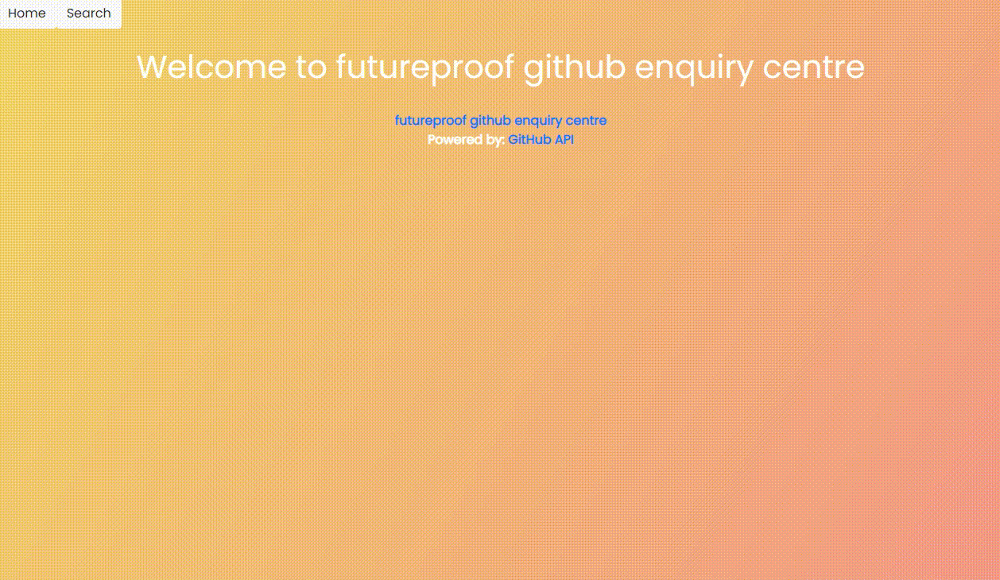

---
# Futureproof Student GitHub Search
- API used: GitHub API (https://docs.github.com/en/rest)

# Feature
- Get all student's GitHub by cohort.
- List their projects.

# Installation
- Execute command 'git clone' to download repo
- Execute command 'npm install' to install
- Execute command 'npm run start'